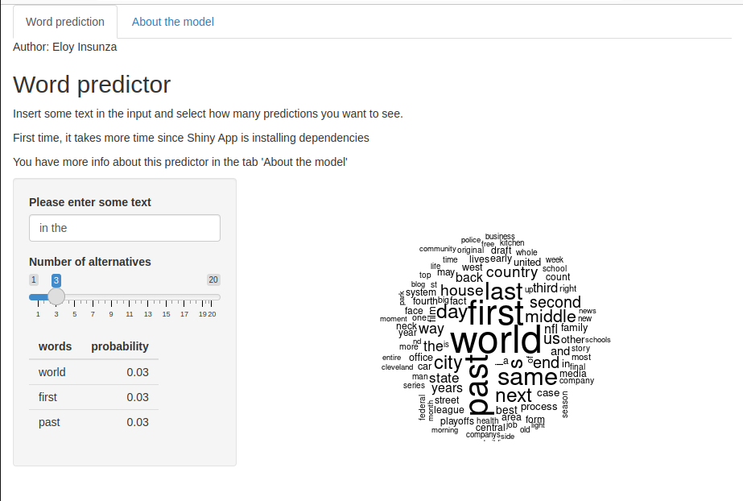

```{r setup, include=FALSE}
knitr::opts_chunk$set(echo = FALSE)
```

## The data product

Text prediction is used in our everyday life: phone keyboards, word processors, search engines... This project aims to imitate a basic version of it. The shiny app available in this [link](https://eloyinsunza.shinyapps.io/WordPredictor/) asks the user to introduce some text and the it will propose some words.

{width=500px}


## The model

- The data consists of +2M sentences from blogs, twitter and news. The raw data is available [here](https://d396qusza40orc.cloudfront.net/dsscapstone/dataset/Coursera-SwiftKey.zip).
- The preprocessing includes removing profanity words, filtering foreign lanugage sentences and treating contractions and special characters.
- The model is interpolation of trigrams, bigrams and unigrams. The less common words were used to model the OOV and a validation data set let find the correct weights for the interpolation.
- For better performance, parallelization and vectorial filtering have been applied.

To better understand the project, visit this [RPubs link](https://rpubs.com/EloyID/1036329) with all the details of the code.

## Analysis

The testing and perplexity analysis show some consistency but also some steps for improvement:

- It cannot predict the use of numbers, punctuation or even uppercase.
- The prediction is limited to news, twitter or blogs. Other data sources can be used for bigger accuracy in other fields.
- The performance and size of the objects could be optimized to be applied in a mobile environment.
- Language detection can be used with more data sets to apply in other languages.

## More information

To know more about this project:

- [Shiny app](https://eloyinsunza.shinyapps.io/WordPredictor/)
- [RPubs](https://rpubs.com/EloyID/1036329)

About me:

- [LinkedIn](https://www.linkedin.com/in/eloy-insunza/?locale=en_US)
- [GitHub](https://github.com/EloyID)
